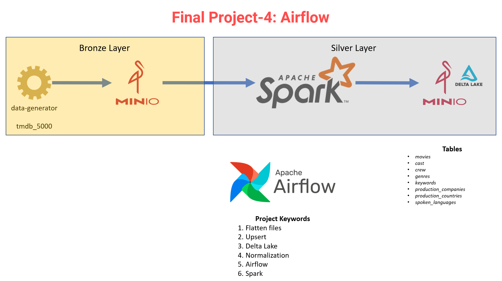

# VBO Data Engineering Bootcamp Final Project-4: Airflow/Delta Lake


# Architecture



-----

# 1. Docker ortamı
- 'docker-compose up -d' ile docker ortamımı başlattım
- command satırında ilgili kütüphaneleri yükledim.ssh_train kullanıcısı oluşturdum . 
- chown ile /opt/spark/history dizin sahipliğini  ssh_train kullanıcısını yetkilendirdim.
- chmod -R 777 /opt/spark/history ile okuma yazma yetkisini açık hale getirdim
- ssh ile erişimi açmak için service ssh start komutunu kullandım
```commandline
# Spark
  spark_client:  
    container_name: spark_client
    image: veribilimiokulu/pyspark-3.4.1_python-3.8:1.0
    ports:
      - 8888:8888
      - 8889:8888
    networks:
      - airflow_spark_minio_sqoop
    volumes:
      - ./spark:/dataops
    command: bash -c "pip install findspark && pip install delta-spark && useradd -rm -d /home/ssh_train -s /bin/bash -g root -G sudo -u 1000 ssh_train && echo 'ssh_train:Ankara06' | chpasswd && chown -R ssh_train /opt/spark/history && su ssh_train -c 'chmod -R 777 /opt/spark/history' && service ssh start && sleep infinity"
```
-----

# 1. Airflow


- airflowda connection ayarları


# 1. Minio


- minioda acces key oluşturdum
````commandline
Access Key : dataops9
Secret Key : Ankara06
````

# 1. jupyterlabte silver layer için 
````python
import pandas as pd
import findspark
findspark.init("/opt/spark")
from pyspark.sql.functions import explode, from_json, explode_outer
from pyspark.sql.functions import col, max, min
from pyspark.sql.types import *
from delta.tables import *

accessKeyId='dataops9'
secretAccessKey='Ankara06'

# create a SparkSession
spark = SparkSession.builder \
.appName("schemas") \
.master("local[2]") \
.config("spark.jars.packages", "org.apache.hadoop:hadoop-aws:3.2.0,io.delta:delta-core_2.12:2.4.0") \
.config("fs.s3a.access.key", accessKeyId) \
.config("fs.s3a.secret.key", secretAccessKey) \
.config("fs.s3a.path.style.access", True) \
.config("fs.s3a.impl", "org.apache.hadoop.fs.s3a.S3AFileSystem") \
.config("spark.sql.extensions", "io.delta.sql.DeltaSparkSessionExtension")\
.config("spark.sql.catalog.spark_catalog", "org.apache.spark.sql.delta.catalog.DeltaCatalog")\
.config("fs.s3a.endpoint", "http://minio:9000") \
.config("spark.sql.debug.maxToStringFields", 1000) \
.getOrCreate()

cast_schema = StructType([
    StructField("movie_id", StringType(), nullable=True),
    StructField("title", StringType(), nullable=True),
    StructField("cast_id", IntegerType(), nullable=True),
    StructField("character", StringType(), nullable=True),
    StructField("credit_id", IntegerType(), nullable=True),
    StructField("gender", IntegerType(), nullable=True),
    StructField("id", IntegerType(), nullable=True),
    StructField("name", StringType(), nullable=True)
])

cast_table = spark.createDataFrame([], cast_schema)
cast_table.write.format("delta").mode("overwrite").save('s3a://tmdb-silver/credits_cast')

crew_schema = StructType([
    StructField("movie_id", StringType(), nullable=True),
    StructField("title", StringType(), nullable=True),
    StructField("credit_id", StringType(), nullable=True),
    StructField("department", StringType(), nullable=True),
    StructField("gender", IntegerType(), nullable=True),
    StructField("id", IntegerType(), nullable=True),
    StructField("job", StringType(), nullable=True),
    StructField("name", StringType(), nullable=True)
])

crew_table = spark.createDataFrame([], crew_schema)
crew_table.write.format("delta").mode("overwrite").save('s3a://tmdb-silver/credits_crew')
movies_schema = StructType([
    StructField("movie_id", StringType(), nullable=True),
    StructField("title", StringType(), nullable=True),
    StructField("budget", DoubleType(), nullable=True),
    StructField("homepage", StringType(), nullable=True),
    StructField("original_language", StringType(), nullable=True),
    StructField("original_title", StringType(), nullable=True),
    StructField("overview", StringType(), nullable=True),
    StructField("popularity", FloatType(), nullable=True),
    StructField("release_date", DateType(), nullable=True),
    StructField("revenue", DoubleType(), nullable=True),
    StructField("runtime", IntegerType(), nullable=True),
    StructField("status", StringType(), nullable=True),
    StructField("tagline", StringType(), nullable=True),
    StructField("vote_average", FloatType(), nullable=True),
    StructField("vote_count", IntegerType(), nullable=True)
])

movies_table = spark.createDataFrame([], movies_schema)
movies_table.write.format("delta").mode("overwrite").save('s3a://tmdb-silver/movies')

genres_schema = StructType([
    StructField("movie_id", StringType(), nullable=True),
    StructField("id", IntegerType(), nullable=True),
    StructField("name", StringType(), nullable=True)
])

genres_table = spark.createDataFrame([], genres_schema)
genres_table.write.format("delta").mode("overwrite").save('s3a://tmdb-silver/genres')

keywords_schema = StructType([
    StructField("movie_id", StringType(), nullable=True),
    StructField("id", IntegerType(), nullable=True),
    StructField("name", StringType(), nullable=True)
])
keywords_table = spark.createDataFrame([], keywords_schema)
keywords_table.write.format("delta").mode("overwrite").save('s3a://tmdb-silver/keywords')

production_companies_schema = StructType([
    StructField("movie_id", StringType(), nullable=True),
    StructField("id", IntegerType(), nullable=True),
    StructField("name", StringType(), nullable=True)
])
production_companies_table = spark.createDataFrame([], production_companies_schema)
production_companies_table.write.format("delta").mode("overwrite").save('s3a://tmdb-silver/production_companies')

production_countries_schema = StructType([
    StructField("movie_id", StringType(), nullable=True),
    StructField("iso_3166_1", StringType(), nullable=True),
    StructField("name", StringType(), nullable=True)
])
production_countries_table = spark.createDataFrame([], production_countries_schema)
production_countries_table.write.format("delta").mode("overwrite").save('s3a://tmdb-silver/production_countries')

spoken_languages_schema = StructType([
    StructField("movie_id", StringType(), nullable=True),
    StructField("iso_639_1", StringType(), nullable=True),
    StructField("name", StringType(), nullable=True)
])
spoken_languages_table = spark.createDataFrame([], spoken_languages_schema)
spoken_languages_table.write.format("delta").mode("overwrite").save('s3a://tmdb-silver/spoken_languages')
````
## Data-Generator
### Installation
````commandline
git clone https://github.com/erkansirin78/data-generator.git
python3 -m pip install virtualenv
cd data-generator/
python3 -m virtualenv datagen
source datagen/bin/activate
pip install -r requirements.txt
````

- Bronze-Layera verileri aktarma
- credits verileri
```commandline
python dataframe_to_s3.py -buc tmdb-bronze \
-k credit/credits_part \
-aki dataops9 -sac Ankara06 \
-eu http://minio:9000 \
-i /dataops/tmdb_5000_movies_and_credits/tmdb_5000_credits.csv \
-ofp True -z 500 -b 0.1 -oh True
```
- movies verileri
```commandline
python dataframe_to_s3.py -buc tmdb-bronze \
-k movies/movies_part \
-aki dataops9 -sac Ankara06 \
-eu http://minio:9000 \
-i /dataops/tmdb_5000_movies_and_credits/tmdb_5000_movies.csv \
-ofp True -z 500 -b 0.1 -oh True
```

# 2. Data transformation 
At this stage, the raw data in the bronze layer is converted to meet the following requirements and written into the silver layer `tmdb-silver/<table_name>` bucket in the form of delta tables specified below.

## 2.1. cast
```commandline
+--------+------+-------+-------------------+------------------------+------+-----+----------------+
|movie_id|title |cast_id|character          |credit_id               |gender|id   |name            |
+--------+------+-------+-------------------+------------------------+------+-----+----------------+
|19995   |Avatar|242    |Jake Sully         |5602a8a7c3a3685532001c9a|2     |65731|Sam Worthington |
|19995   |Avatar|3      |Neytiri            |52fe48009251416c750ac9cb|1     |8691 |Zoe Saldana     |
|19995   |Avatar|25     |Dr. Grace Augustine|52fe48009251416c750aca39|1     |10205|Sigourney Weaver|
|19995   |Avatar|4      |Col. Quaritch      |52fe48009251416c750ac9cf|2     |32747|Stephen Lang    |
+--------+------+-------+-------------------+------------------------+------+-----+----------------+
```
- One row represents one player. 
- credit_id nulls must be imputed with "0000000000".

## 2.2. crew
```commandline
+--------+------+------------------------+----------+------+----+------------------------+-----------------+
|movie_id|title |credit_id               |department|gender|id  |job                     |name             |
+--------+------+------------------------+----------+------+----+------------------------+-----------------+
|19995   |Avatar|52fe48009251416c750aca23|Editing   |0     |1721|Editor                  |Stephen E. Rivkin|
|19995   |Avatar|539c47ecc3a36810e3001f87|Art       |2     |496 |Production Design       |Rick Carter      |
|19995   |Avatar|54491c89c3a3680fb4001cf7|Sound     |0     |900 |Sound Designer          |Christopher Boyes|
|19995   |Avatar|54491cb70e0a267480001bd0|Sound     |0     |900 |Supervising Sound Editor|Christopher Boyes|
+--------+------+------------------------+----------+------+----+------------------------+-----------------+
```
- One row represents one crew.
- credit_id nulls must be imputed with "0000000000".


## 2.3. movies
```commandline 
+--------+--------------------+------+--------------------+-----------------+--------------------+--------------------+----------+------------+-------------+-------+--------+--------------------+------------+----------+
|movie_id|               title|budget|            homepage|original_language|      original_title|            overview|popularity|release_date|      revenue|runtime|  status|             tagline|vote_average|vote_count|
+--------+--------------------+------+--------------------+-----------------+--------------------+--------------------+----------+------------+-------------+-------+--------+--------------------+------------+----------+
|   19995|              Avatar|2.37E8|http://www.avatar...|               en|              Avatar|In the 22nd centu...| 150.43758|  2009-12-10|2.787965087E9|    162|Released|Enter the World o...|         7.2|     11800|
|     285|Pirates of the Ca...| 3.0E8|http://disney.go....|               en|Pirates of the Ca...|Captain Barbossa,...| 139.08261|  2007-05-19|       9.61E8|    169|Released|At the end of the...|         6.9|      4500|
|  206647|             Spectre|2.45E8|http://www.sonypi...|               en|             Spectre|A cryptic message...|107.376785|  2015-10-26| 8.80674609E8|    148|Released|A Plan No One Esc...|         6.3|      4466|
|   49026|The Dark Knight R...| 2.5E8|http://www.thedar...|               en|The Dark Knight R...|Following the dea...| 112.31295|  2012-07-16|1.084939099E9|    165|Released|     The Legend Ends|         7.6|      9106|
|   49529|         John Carter| 2.6E8|http://movies.dis...|               en|         John Carter|John Carter is a ...| 43.926994|  2012-03-07|   2.841391E8|    132|Released|Lost in our world...|         6.1|      2124|
+--------+--------------------+------+--------------------+-----------------+--------------------+--------------------+----------+------------+-------------+-------+--------+--------------------+------------+----------+
```
- Schema:
```commandline
root
 |-- movie_id: string (nullable = true)
 |-- title: string (nullable = true)
 |-- budget: double (nullable = true)
 |-- homepage: string (nullable = true)
 |-- original_language: string (nullable = true)
 |-- original_title: string (nullable = true)
 |-- overview: string (nullable = true)
 |-- popularity: float (nullable = true)
 |-- release_date: date (nullable = true)
 |-- revenue: double (nullable = true)
 |-- runtime: integer (nullable = true)
 |-- status: string (nullable = true)
 |-- tagline: string (nullable = true)
 |-- vote_average: float (nullable = true)
 |-- vote_count: integer (nullable = true)
```

## 2.4. genres
```commandline
+--------+---+---------------+
|movie_id| id|           name|
+--------+---+---------------+
|   19995| 28|         Action|
|   19995| 12|      Adventure|
|   19995| 14|        Fantasy|
|   19995|878|Science Fiction|
|     285| 12|      Adventure|
+--------+---+---------------+
```
- Schema
```commandline
root
 |-- movie_id: string (nullable = true)
 |-- id: integer (nullable = true)
 |-- name: string (nullable = true)
```
- id nulls must be imputed with -9999.

## 2.5. keywords
```commandline
+--------+----+-------------+
|movie_id|  id|         name|
+--------+----+-------------+
|   19995|1463|culture clash|
|   19995|2964|       future|
|   19995|3386|    space war|
|   19995|3388| space colony|
|   19995|3679|      society|
+--------+----+-------------+
```
- Schema
```commandline
root
 |-- movie_id: string (nullable = true)
 |-- id: integer (nullable = true)
 |-- name: string (nullable = true)
```
- id nulls must be imputed with -9999.

## 2.6. production_companies
```commandline
+--------+---+--------------------+
|movie_id| id|                name|
+--------+---+--------------------+
|   19995|289|Ingenious Film Pa...|
|   19995|306|Twentieth Century...|
|   19995|444|  Dune Entertainment|
|   19995|574|Lightstorm Entert...|
|     285|  2|Walt Disney Pictures|
+--------+---+--------------------+
```
- Schema
```commandline
root
 |-- movie_id: string (nullable = true)
 |-- id: integer (nullable = true)
 |-- name: string (nullable = true)
```
- id nulls must be imputed with -9999.

## 2.7. production_countries
```commandline
+--------+----------+--------------------+
|movie_id|iso_3166_1|                name|
+--------+----------+--------------------+
|   19995|        US|United States of ...|
|   19995|        GB|      United Kingdom|
|     285|        US|United States of ...|
|  206647|        GB|      United Kingdom|
|  206647|        US|United States of ...|
+--------+----------+--------------------+
```
- Schema
```commandline
root
 |-- movie_id: string (nullable = true)
 |-- iso_3166_1: string (nullable = true)
 |-- name: string (nullable = true)
```
- iso_3166_1 nulls must be imputed with XX.

## 2.8. spoken_languages
```commandline
+--------+---------+--------+
|movie_id|iso_639_1|    name|
+--------+---------+--------+
|   19995|       en| English|
|   19995|       es| Español|
|     285|       en| English|
|  206647|       fr|Français|
|  206647|       en| English|
+--------+---------+--------+
```
- Schema
```commandline
root
 |-- movie_id: string (nullable = true)
 |-- iso_639_1: string (nullable = true)
 |-- name: string (nullable = true)
```
- iso_639_1 nulls must be imputed with XX.

# 3. Pipeline
- Dagte kullancağım dosyaları ilgili konuma attım
```commandline
 docker cp tmdb_credits_to_s3.py spark_client:/dataops
 docker cp tmdb_movies_Tables_to_s3.py spark_client:/dataops
 docker cp silver_credits_dag.py airflow-scheduler:/opt/airflow/dags
```
- Pipeline should run daily.
- pipeline şema


### Data source
https://www.kaggle.com/datasets/tmdb/tmdb-movie-metadata?select=tmdb_5000_movies.csv

